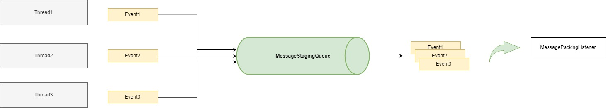
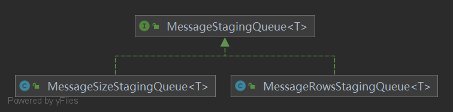

### Message-Tools

#### 功能1： 消息打包
单个消息，自动打包成批量消息功能。
###### 解决问题
1、解决同一类消息发送频率高,多点发送。出现消息阻塞,消费者消费频率高等场景。

###### 原理
将单独发送的消息做合并处理，按照大小，或者行数进行合并处理发送。


###### 使用
```java

package com.openquartz.messagetools.packing;

/**
 * MessageStagingQueue
 *
 * @param <T> T
 */
public interface MessageStagingQueue<T> {

    /**
     * put message
     *
     * @param value value message
     */
    void put(T value);

    /**
     * add message
     *
     * @param value value
     */
    default void add(T value) {
        put(value);
    }

    /**
     * put and flush message
     *
     * @param value value message
     */
    default void putAndFlush(T value) {

        // put message
        put(value);

        // flush message
        flush();
    }

    /**
     * flush message
     */
    void flush();

}
```

默认实现：
- 按照消息行数打包(com.openquartz.messagetools.packing.MessageRowsStagingQueue)
- 按照消息大小打包(com.openquartz.messagetools.packing.MessageSizeStagingQueue)



提供打包监听服务.
```java
package com.openquartz.messagetools.packing;

import java.util.List;

/**
 * Message Packing Listener
 * @param <T>
 * @author svnee
 */
public interface MessagePackingListener<T> {

    /**
     * on packing message
     * @param messageList packing result
     */
    void onPacking(List<T> messageList);

}
```

